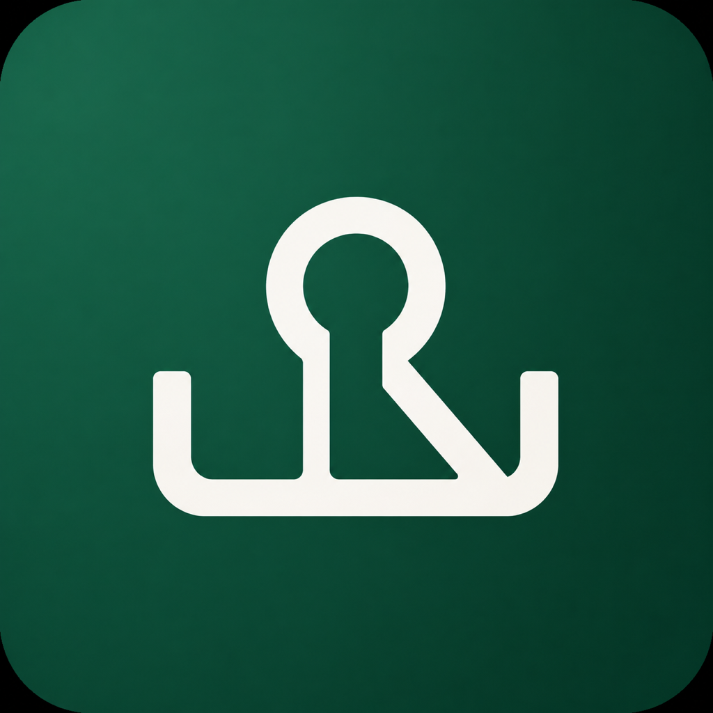

<p align="center">
  
</p>

<h1 align="center">KeyDock</h1>

<p align="center">
  <strong>面向 AI 时代开发者的可复用环境变量 Presets。</strong>
  <br />
  本地存储 API Keys，组合成 Presets，一键激活到所有新终端。
</p>

<p align="center">
  <a href="README.md">English</a>
  ·
  <a href="README.zh-CN.md">中文</a>
</p>

<p align="center">
  
  
  
  
  
  
</p>

---

> KeyDock 是**本地优先的开发者 API Key 保险库**，并支持一键激活环境变量 Presets。本地保存密钥，组合成可复用的 Presets，一键激活到所有新终端。

KeyDock 不打算一开始就替代企业级 SecretOps / Vault 平台。它优先解决开发者工作站这一层：个人开发者、小团队、AI 辅助编程场景里，`.env` 四处复制和全局 shell export 太容易泄露。

## 为什么需要 KeyDock？

今天的开发工作流里到处都是密钥：AI 服务商 Key、代理地址、账号 ID、云平台 Token、搜索 API、客户项目凭证。

把它们复制到不同 `.env` 文件里很脆弱；全局导出到 shell 又不安全。

KeyDock 提供一个更清晰的闭环：

1. 把密钥存进本地加密保险库。
2. 从模板创建 Presets（OpenAI、Anthropic、Cloudflare、Vercel、Supabase、Stripe 等）。
3. 组合 Presets —— `fullstack-dev` 包含 `ai-dev` 和 `cloud-deploy`。
4. 激活一个 Preset，所有新终端都继承同一组可信环境变量。

下一阶段的产品方向是 **agent-safe secret injection**：让 Codex、Claude Code、Cursor、脚本和 dev server 只拿到某个命令所需的 scoped 变量，并用本地审计与输出脱敏建立信任。

## 亮点功能

| 能力 | 说明 |
| --- | --- |
| **本地加密保险库** | 使用 Argon2id + ChaCha20Poly1305 将密钥保存在本机。 |
| **Preset 模板** | 内置 OpenAI、Anthropic、Cloudflare、Vercel、Supabase、Stripe 等常用服务模板。 |
| **Preset 组合** | 组合多个 Presets —— `fullstack-dev` 包含 `ai-dev` + `cloud-deploy`。 |
| **Preset 激活** | 激活一个 Preset 供所有新终端使用。告别 `.env` 混乱。 |
| **单次命令注入** | 不污染全局 shell 状态，只给当前命令注入 preset 环境变量。 |
| **桌面控制台** | 基于 Tauri + React，包含 Dashboard、Secrets、Presets、Audit、Settings。 |
| **审计可见性** | 记录 reveal、copy、export、mutation 等敏感操作。 |
| **Shell 集成** | 支持生成 `zsh` / `bash` hook。 |
| **双语基础** | 内置 English / 中文 locale，基于 i18next。 |
| **AI-agent-safe 方向** | 路线图重点：scoped injection、输出脱敏、命令级审计。 |

## 使用体验

```bash
# 为后续新 shell 激活一个 preset
keydock preset activate fullstack-dev

# 查看当前激活状态
keydock preset current

# 预览 preset 将导出的环境变量
keydock preset preview fullstack-dev

# 仅为这一次命令注入 preset 环境变量
keydock run fullstack-dev -- bun run dev

# 清除当前激活的 preset 缓存
keydock preset deactivate
```

## 项目架构

```text
KeyDock
├─ src/                  # React 桌面端 UI
│  ├─ components/         # Dashboard、Secrets、Presets、Audit、Settings
│  ├─ hooks/              # Vault、Secrets、Presets、Clipboard、Theme、i18n
│  ├─ i18n/               # 英文 / 中文语言资源
│  └─ lib/tauri.ts        # 前端到 Tauri commands 的类型化桥接
├─ src-tauri/             # Tauri 外壳与原生命令处理
├─ crates/keydock-core/   # Vault、Crypto、Storage、Models、Preset env 逻辑
└─ crates/keydock-cli/    # `keydock` 命令行工具
```

## 快速开始

### 环境要求

- [Bun](https://bun.sh/)
- [Rust](https://www.rust-lang.org/tools/install)
- [Tauri v2](https://tauri.app/) 对应平台依赖

### 安装并启动

```bash
bun install
bun run tauri dev
```

### 构建前端资源

```bash
bun run build
```

### 运行 Rust 测试

```bash
cargo test
```

### 查看 CLI 帮助

```bash
cargo run -p keydock-cli -- --help
```

## CLI 命令速查

```bash
keydock preset templates            # 列出可用的 preset 模板
keydock preset list                 # 列出所有 preset
keydock preset show <preset>        # 查看 preset 详情
keydock preset preview <preset>     # 预览将导出的环境变量
keydock preset activate <preset>    # 为新 shell 激活 preset
keydock preset current              # 查看当前激活的 preset
keydock preset deactivate           # 删除当前 active preset 缓存
keydock hook <zsh|bash>             # 输出 shell hook 代码
keydock open                        # 在 macOS 上打开 KeyDock 桌面端
keydock run <preset> -- <cmd>       # 使用 preset 环境变量运行命令
```

## 安全模型

KeyDock 的默认设计是 **local-first**：

- 使用 master password，并通过 **Argon2id** 派生密钥。
- 解锁后解密本地 data-encryption key。
- 保险库解锁期间，解密后的 key 只保留在应用内存中。
- 预设激活会写入 plaintext env cache，让新 shell 能加载映射后的变量。
- 单次命令注入不会污染全局 shell，是 AI agent 和自动化命令的优先推荐路径。
- Touch ID / passkey 计划作为便利解锁路径，而不是唯一根密钥。

> 请像对待其它明文 shell secret 一样对待已激活的预设缓存：它是本地的、方便的，也应当只在需要时短期存在。

对于 AI 编程助手，优先使用 `keydock run <preset> -- <cmd>`，不要全局导出密钥。KeyDock 期望建立的信任边界是“命令级访问”，而不是“agent 能读取整个 shell 环境”。

## 当前范围

已实现 / 进行中：

- 本地加密 Secret 存储
- Preset 模板（OpenAI、Anthropic、Cloudflare、Vercel、Supabase、Stripe 等）
- Preset 组合（include 其它 presets）
- Preset 激活与停用
- CLI preset 管理与单次命令注入
- Tauri 桌面端 UI
- Quick copy 格式
- Audit log UI
- 英文 / 中文应用语言资源

暂缓：

- Agent-safe scoped secret injection presets
- 命令日志输出脱敏
- 本地 secret health checks
- Repo / agent config 泄露扫描
- Local HTTP API
- Cloud sync
- Team sharing
- RBAC
- Plugin system
- Automatic preset switching

## 路线图重点

### v0.6：可发布、可演示的开发者工作流

- 保持所有版本元数据、发布地址、更新地址都指向 `0xfig-labs/KeyDock`。
- 优化首次使用：创建保险库、从模板添加第一个 secret、创建 preset、激活它。
- 在官网预留截图 / GIF：vault UI、preset 组合、CLI injection。
- 清晰说明 unsigned/ad-hoc macOS 分发限制，同时准备 Developer ID signing 和 notarization。

### v0.7：AI-agent-safe mode

- 命令级环境变量 allowlist。
- Agent profiles：Codex、Claude Code、Cursor、generic shell。
- 本地审计：哪个命令访问了哪个 preset 变量。
- 日志和复制命令输出的脱敏辅助。

### 后续

- 本地 secret health checks 和轮换提醒。
- 加密导入/导出，用于轻量共享。
- 等 local-first 工作流验证后，再考虑可选 team/cloud sync。

## 开发工作流

```bash
# 安装依赖
bun install

# 启动桌面端
bun run tauri dev

# 前端构建
bun run build

# Rust 测试
cargo test
```

---

<p align="center">
  为每天在项目、模型、云服务和客户之间切换的开发者而生。
</p>
